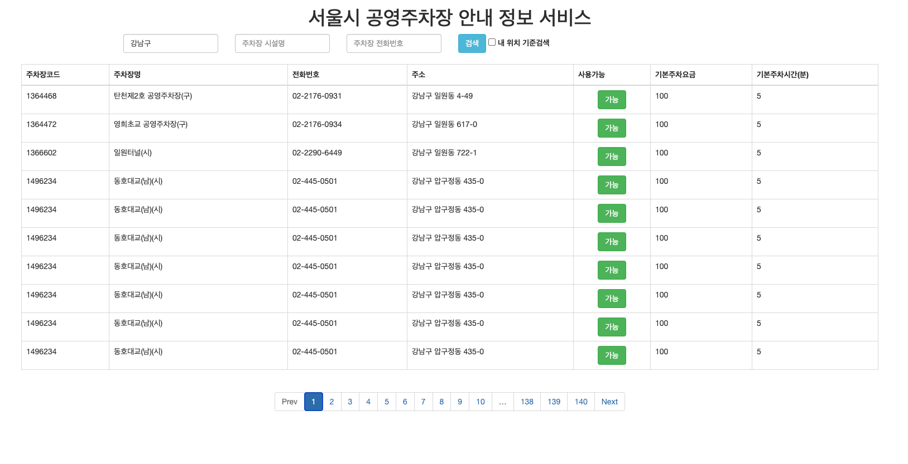

# 서울시 공영 주차장 안내 정보 서비스 
서울 열린데이터 광장의 공공 Open API를 이용 서울시 공영 주차장 정보를 제공하는 Web application 입니다.
- 주소,전화번호,시설명 검색기능 제공 
- 최저 요금 기준(30분 기본요금 간주)
- 사용가능 여부 표시(현 시각 기준)
<br />
<kbd></kbd><br />

## Getting Started
빌드를 하기 위해서 Maven과 Node,Npm 이 필요하나 애플리케이션 코드에 Built in 
돼있기 때문에 소프트웨어를 실행하기 위해서는 Java 11만 호스트에 설치돼 있으면 됩니다. 
source를 Zip형태로 다운받을 경우에는 Git 또한 설치할 필요는 없습니다.
### Prerequisites

```
Java 11+
Git
```

### Installing

```
git clone https://github.com/warpgate3/project-k.git
```

### Build

```
./mvnw clean install
```

### Deployment
```
java -jar ./bo/seoul-data-searcher.jar
```

### Deployment (Docker)
호스트에 [Dokcer](https://docs.docker.com/get-docker/) 가 설치돼 있어야 합니다. 

Build 
```
./mvnw clean install -pl bo docker:build
```
Run
```
docker run -itd --name seoul-data-searcher info/m2sj/seoul-data-searcher 
```

## Start
```
http://localhost:8080
```
## API
API 문서는 Swagger를 통해 제공합니다.
```
http://localhost:8080/swagger-ui.html
```
## Built With

* [Spring Boot 2.3.1](https://spring.io/projects/spring-boot) 
* [Maven](https://maven.apache.org/) 
* [Vue.js](https://vuejs.org/)
* [Bootstrap](https://getbootstrap.com/)
